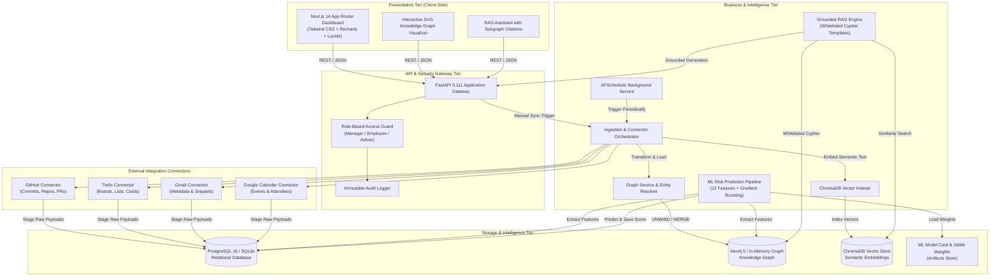

# TwinOS System Architecture & Design Specification

This document provides the authoritative architectural blueprint for **TwinOS**, an enterprise-grade AI-powered project management platform integrating knowledge graphs, predictive machine learning, and retrieval-augmented generation (RAG) to eliminate delivery delays.

---

## 1. High-Level Architectural Paradigm

TwinOS operates on a **Tri-Store Architecture** coupled with an event-driven synchronization engine:

```
[ External SaaS APIs / Mock Fixtures ]
     │
     ▼
[ Ingestion & Connectors (Tenacity Resilient) ]
     │
     ├──► [ Relational Store (PostgreSQL / SQLite) ] ── (Users, Auth, Audit, Ingestion Runs, Alerts)
     ├──► [ Knowledge Graph (Neo4j / In-Memory Graph) ] ── (Employees, Projects, Tasks, Deadlines, Repos, Commits, Emails, Events)
     └──► [ Vector Store (ChromaDB Collection) ] ── (Commit diffs, PR reviews, Email snippets, Meeting transcripts)
```

By decoupling structured relational state, highly-connected graph topology, and dense semantic vector embeddings, TwinOS achieves:
1. **Multi-Hop Relational Traversal:** Instant Cypher queries across developer workload, commit frequency, and card status.
2. **Context-Grounded Natural Language RAG:** Complete immunity to LLM hallucination through whitelisted Cypher templates and source citations.
3. **Auditable Predictive ML:** Feature extraction combining graph metrics (workload, unassigned tasks) with velocity indicators to forecast delivery delays with mathematical confidence.

---

## 2. End-to-End System Topology (Mermaid Diagram)



---

## 3. Layered Architectural Decomposition

### 3.1 Presentation Layer (Next.js 14 App Router)
- **Framework:** Next.js 14 with TypeScript, Tailwind CSS, and Recharts.
- **Design System:** Custom executive dark theme (`slate-950` background, `primary-600` cyan accents, glassmorphic panels, glowing status indicators).
- **Core Views:**
  - `/dashboard`: High-level executive KPI cards, risk distribution bar charts, and project cards.
  - `/assistant`: Conversational RAG interface with real-time response rendering and clickable citation badges.
  - `/graph`: Interactive SVG graph visualizer with zoom, pan, entity filtering, and node property inspection drawer.
  - `/projects` & `/projects/[id]`: Project portfolio overview and deep-dive risk factor diagnostic breakdown.
  - `/my-work`: Employee-centric Kanban board with live task status transition controls (`todo`, `in_progress`, `review`, `done`).
  - `/alerts`: Proactive delay escalation notifications with recommended mitigation strategies.
  - `/admin/users`, `/admin/connections`, `/admin/risk-config`, `/admin/audit`: Administrative controls for RBAC, platform connections, ML sensitivity sliders, and immutable audit logs.

### 3.2 Gateway & Security Layer (FastAPI + RBAC)
- **Framework:** FastAPI running on Uvicorn.
- **Authentication Modes:**
  - `dev`: High-velocity local testing supporting `Authorization: Bearer dev:<email>` and `X-User-Email` headers with automatic role resolution.
  - `firebase`: Production identity verification via Firebase Admin SDK decoding RS256 JWT tokens.
- **RBAC Enforcement:** Declarative `require_role("manager", "admin")` dependencies guarding endpoints. Requests from unauthorized roles return HTTP 403 Forbidden with zero data leakage.
- **Audit Service:** Every administrative mutation (`user_created`, `user_updated`, `risk_config_updated`, `sync_run`) is recorded in the immutable `audit_logs` table.

### 3.3 Intelligence & Processing Layer

#### 3.3.1 Ingestion & Connector Resilience
- Connectors conform to `BaseConnector` (`fetch_data()`, `stage_records()`).
- Upstream network errors and API throttling are intercepted using **Tenacity exponential backoff** with jitter.
- The GitHub connector explicitly tracks `X-RateLimit-Remaining` and `X-RateLimit-Reset`, entering graceful backoff sleep rather than dropping records (TC-02).
- The Gmail connector adheres strictly to **Least Privilege**, capturing message headers (Subject, Date, From, To) and short snippets without storing message bodies or attachments.

#### 3.3.2 Machine Learning Delay Risk Pipeline
- **Feature Space (12 Features):**
  1. `total_tasks`: Project scope volume.
  2. `completed_tasks`: Finished work items.
  3. `overdue_tasks`: Cards past deadline.
  4. `completion_rate`: `completed_tasks / total_tasks`.
  5. `unassigned_tasks`: Tasks lacking an assignee.
  6. `days_to_nearest_deadline`: Proximity to the closest milestone.
  7. `commit_count_14d`: Developer code activity in the trailing 14 days.
  8. `active_developers`: Unique commit authors in the trailing 14 days.
  9. `email_thread_count`: Project discussion volume.
  10. `calendar_event_count`: Coordination meeting overhead.
  11. `history_days`: Duration of project tracking.
  12. `workload_skew`: Gini coefficient / variance of task distribution among team members.
- **Model Architecture:**
  - Baseline: Scikit-learn Logistic Regression.
  - Champion: Scikit-learn Gradient Boosting Classifier (`backend/app/ml/train.py`).
  - Model Card: Fully documented in `backend/app/ml/artifacts/model_card.json`.
- **Explainability:**
  - Computes top 3 contributing factors via standardized z-score deviation without requiring heavy SHAP runtimes.
- **Cold-Start Policy (TC-05):**
  - If a project's active tracking history is under `min_history_days` (default: 14 days), the system assigns `confidence: "low"` and relies on baseline risk priors, suppressing misleading high-precision false alarms.

#### 3.3.3 Retrieval-Augmented Generation (RAG) Engine
- **Whitelisted Cypher Templates:** Natural language user prompts are classified into parameterized Cypher templates (e.g. `get_overdue_tasks_for_project`, `get_developer_workload`, `get_project_summary`).
- **Role-Based Subgraph Pruning:**
  - For `manager` and `admin`, graph queries span the complete organizational boundary.
  - For `employee`, traversals are automatically restricted to subgraphs where the employee is linked via `[:WORKS_ON]` or `[:ASSIGNED_TO]`.
- **Exact Citation Anchoring:** Every statement synthesized by the LLM is anchored to citations referencing the specific graph node ID, label, and text snippet.

---

## 4. 8-Entity Knowledge Graph Schema

The Neo4j Knowledge Graph represents organizational knowledge across 8 discrete node entities connected by 9 directed relationship types:

### 4.1 Node Labels & Schema
| Node Label | Key Properties | Source Integration | Purpose |
| :--- | :--- | :--- | :--- |
| `Employee` | `id`, `name`, `email`, `role`, `team` | System / Google / GitHub | Organizational identity and assignee |
| `Project` | `id`, `name`, `description`, `status`, `organization_id` | Trello Board / System | Delivery milestone container |
| `Task` | `id`, `title`, `status`, `priority`, `due_date`, `created_at` | Trello Card | Discrete unit of work |
| `Deadline` | `id`, `date`, `description`, `milestone_type` | Trello Card / Project | Target milestone or SLA date |
| `Repository` | `id`, `name`, `url`, `default_branch` | GitHub Repository | Codebase storage container |
| `Commit` | `id`, `sha`, `message`, `timestamp`, `lines_changed` | GitHub Commit | Engineering implementation event |
| `Email` | `id`, `subject`, `timestamp`, `snippet`, `thread_id` | Gmail Message | Stakeholder discussion record |
| `Event` | `id`, `title`, `start_time`, `end_time`, `attendee_count` | Google Calendar Event | Team synchronization milestone |

### 4.2 Relationship Matrix
| Source Node | Relationship | Target Node | Cardinality | Semantic Meaning |
| :--- | :--- | :--- | :--- | :--- |
| `Employee` | `[:WORKS_ON]` | `Project` | M:N | Developer allocation to project |
| `Task` | `[:PART_OF]` | `Project` | N:1 | Task ownership under a project |
| `Task` | `[:ASSIGNED_TO]` | `Employee` | N:1 | Assignee responsible for execution |
| `Task` | `[:HAS_DEADLINE]` | `Deadline` | N:1 | Task completion due date |
| `Project` | `[:HAS_DEADLINE]` | `Deadline` | N:M | Project release milestone |
| `Project` | `[:HAS_REPOSITORY]` | `Repository` | 1:N | Project code repositories |
| `Commit` | `[:COMMITTED_TO]` | `Repository` | N:1 | Git commit target repo |
| `Employee` | `[:AUTHORED]` | `Commit` | 1:N | Engineer commit authorship |
| `Employee` | `[:PARTICIPATED_IN]` | `Email` | N:M | Email sender/recipient linkage |
| `Employee` | `[:ATTENDED]` | `Event` | N:M | Meeting participation |

---

## 5. Security & Isolation Architecture

1. **Least-Privilege Third-Party Access:** Tokens stored in PostgreSQL are encrypted at rest using AES-GCM/Fernet encryption (`backend/app/integrations/oauth.py`). Gmail access requests only header metadata and snippets.
2. **Secret Redaction in Logging:** A custom log filter (`backend/app/core/logging.py`) intercepts all logging output and scrubs OAuth tokens, Firebase keys, bearer credentials, and authorization headers with `[REDACTED]`.
3. **Multi-Tenant Scoping:** All relational tables and graph queries partition data strictly by `organization_id`.
4. **Immutable Audit Ledger:** High-risk actions (`user_created`, `user_updated`, `risk_config_updated`, `sync_run`) append directly to `audit_logs` without delete or overwrite endpoints.
